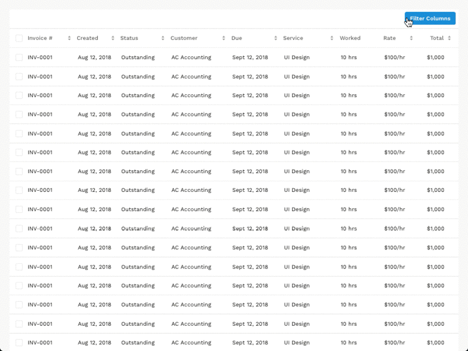

# \<sacs-filter-datatable\>

Necesito tener parametros dentro de mi data table para poder configurar vistas especificas de acuerdo a lo que requiera en ese momento y al guardar la vista tenga la informacion correspondiente cuando entre de nuevo a la pantalla, esto con el objetivo de tener mis datos organizados de la manera mas efectiva posible y poder encontrarlos muy rapido.

## Criterios de aceptación

- Filtros personalizados y guardar la vista con el criterio del usuario para su uso de manera personalizada. Una vez creado le puedes poner un nombre y dejarla como vista principal o dejarla como secundaria y después escogerla, puedes crear múltiples vistas de acuerdo al criterio. 
- Crear los valores y formulas correspondientes para que sea simple para el usuario filtrar de acuerdo a sus necesidades y poder guardar el nombre de la vista para su proxima vista rapida en el data table.
- El usuario siempre tendra la vista principal como default, sin embargo le aparecera en una lista en el mismo data table las vistas que ha creado para su beneficio y buena experiencia de usuario


## Example




## Install the Polymer-CLI

First, make sure you have the [Polymer CLI](https://www.npmjs.com/package/polymer-cli) installed. Then run `polymer serve` to serve your element locally.

## Install component

```
bower i --save sacscloud/sacs-filter-datatable
```

## Viewing Your Element

```
$ polymer serve
```

## Test of component

The component must have the test basic:

- The component exist
- The component is in the DOM

The component must have test for properties:

- The property exist
- The property is declareded
- The property not is undefined

The component must have test for functions:

- The function is declareded
- The function exist
- The function don't throw error

### Running Tests

```
$ polymer test
```

Your application is already set up to be tested via [web-component-tester](https://github.com/Polymer/web-component-tester). Run `polymer test` to run your application's test suite locally.


## Properties

Las propiedades descritas solo son la base pero se deben agregar todas las que sean necesarias.

Name | Type | Description | Default
-----|-------------|---------|--------
`example` | `Array` | array to data | `[]`


## Methods

Las metodos descritos solo son la base pero se deben agregar todos las que sean necesarios.

Method | Description | Parameters | Return
-----|-------------|---------|------------
`example` | description | param | no retorna nada


## Events

Este componente no lanza ningun evento.

## Dependencies

Este componente no usa dependencias de otros componentes

## Use

```
<sacs-filter-datatable</sacs-filter-datatable>
```

## Behaviour

Descripcion del comportamiento interno del componente.

## Styling

Las siguientes propiedades y mixins estan disponibles para styling.

Custom property | Description | Default
----------------|-------------|----------
`--sacs-filter-datatable-color` | background color | `#fff`

## Versions

El componente debe ser tageado para cada nuevo commit:

```
git tag v1.0.0
```
y se debe subir al repositorio

```
git push origin master v1.0.0
```

La version en el bower json tambien debe ser actualizada